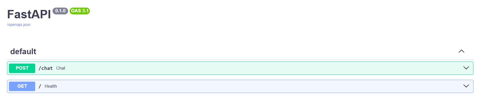
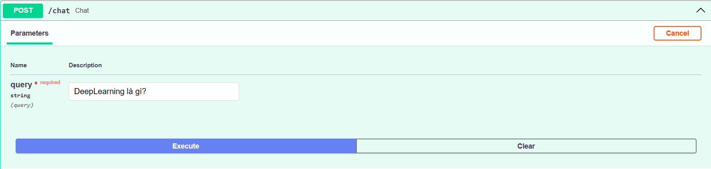
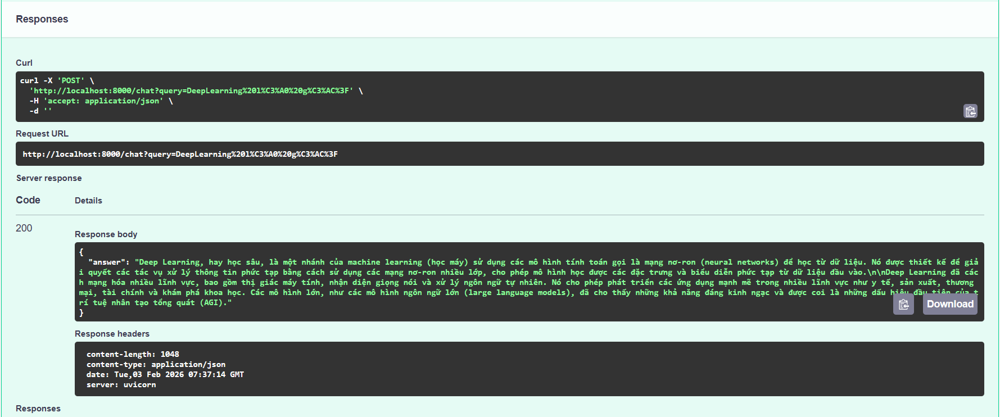

# document_retrieval

### Description: This system utilize LangChain's AI Agents framework to do local domain specialized document retrieval. Especially fits for small - medium domain centralized coporation. Learners can folk this repo for educational purposes. 

## Key Features

- **Runs fully locally** (no external vector DB required)
- **Domain-specialized document retrieval**
- **Scalable architecture** (swap vector stores, rerankers, retrievers)
- **Agent-based reasoning with LangChain**
- **Educational & modular codebase**
- **Supports Vietnamese and English queries**

## *Env requirements*
LANGSMITH_TRACING=your_langsmith_tracing
LANGSMITH_ENDPOINT=your_langsmith_endpoint
LANGSMITH_API_KEY=your_langsmith_api_key
LANGSMITH_PROJECT="your application"
OPENAI_API_KEY=your_openai_api_key

## *How to run it?*

Navigate to project: `cd <user_name>\RAG_Application\`

Environment setup: `pip install -r requirements`

Change environment name: `.env_template` -> `.env`

- Requirements: 200 ~ 300MB storage in order for this system runnable

Create data dir: `mkdir data/source`
- This project supports PDF, TXT files. It also reads URLs, you have to make adjustments in `src\core\build_index.py`

Index the document: `python -m src.core.build_inndex` 
- You'll need to execute this when for the first time or when there is any new documents inside the data dir.
- Data is save locally inside `data/faiss_index`

Launch application: `uvicorn src.api.main:app --host 0.0.0.0 --port 8000`
- Application Access URL: `http://localhost:8000/docs`, on POST section you can "Try it out".

*It supports Vietnam queries, of course* 

*'Response body" is the main part that you want to look at*

## *Configuration*
- `src/loading/document_loading.py`: HTML tag retrieves
- `src/splitting/splitting.py`: splitter's `chunk_size`, `chunk_overlap` for optimizability
- `src/vector_store/`: There are wide range of databases that you can implement, but vector storing features is required for that database to work with this type of projects. Ex: `AstraDB`, `Chroma`, `PGVector`, `FAISS`,...
- `src/vector_store/faiss.py`: faiss supports `Euclidean`, `Cosine` and `HNSW`; use-case: `Euclidean`, `Cosine` are for magniture, degree perspectively and, `HNSW` is a approximate function that works well on large - scale datasets.
- `src/tools/`: This is where `tools` are stored, tools are utilize for `AI Agents`. These tools are like AI Agent methods, tells what an Agent can do with this tools.
- `src/tools/retrieve_context.py`: You can adjust the amount docs that an Agent can retrieve, default `k=20`, choose carefully though.
- `src/reranker/`: Mainly `Bi-encoders`, `Cross-encoders`, `Token-level Dense Retrieval` are used in reranking. This project uses cross-encoder for suitable execution time, and output quality.
- `src/reranker/cross_encoder.py`: you can adjust number of retrieve docs for prompt's input.